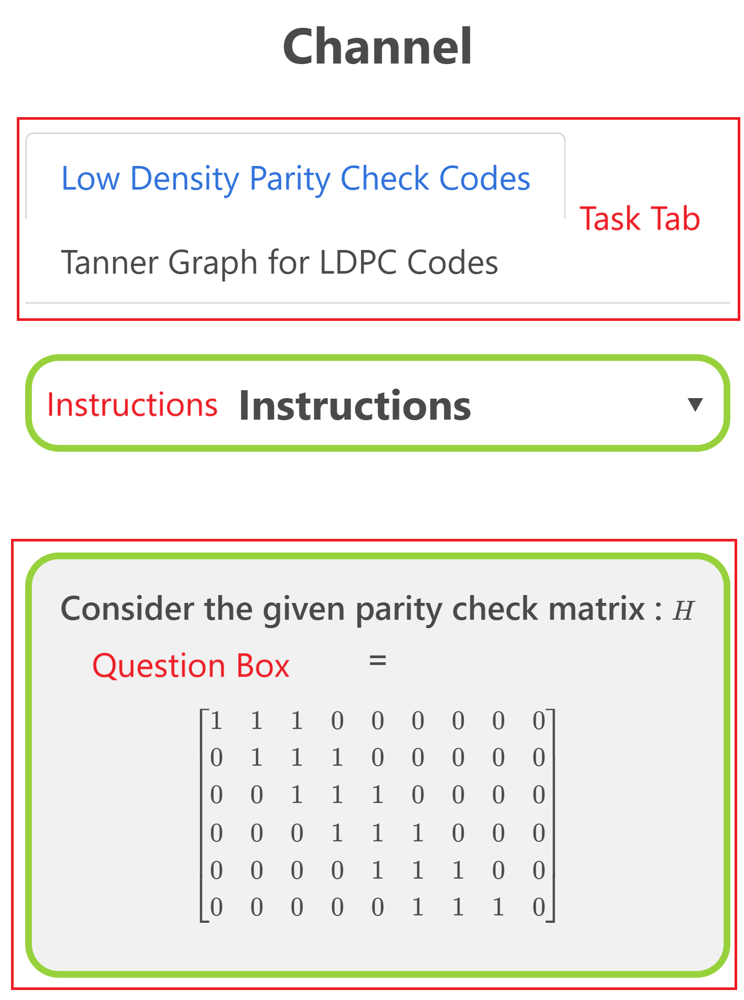
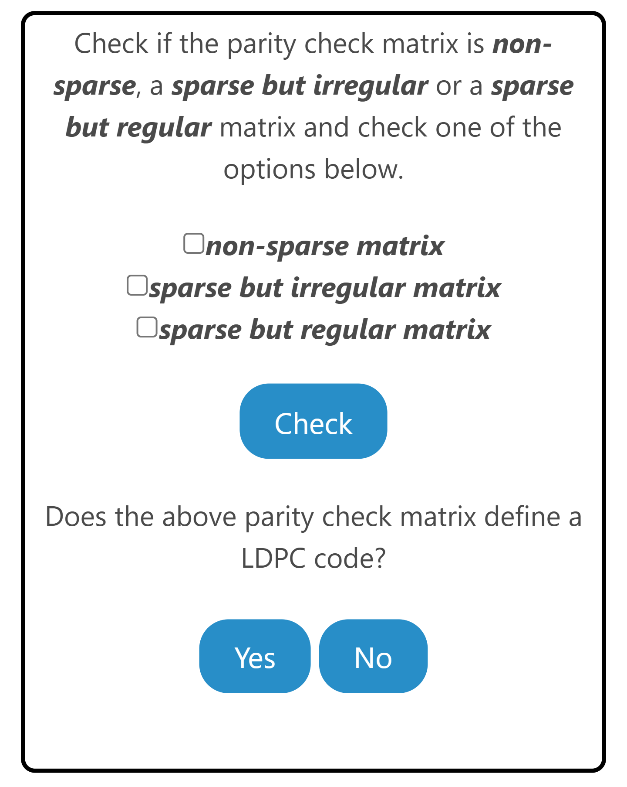
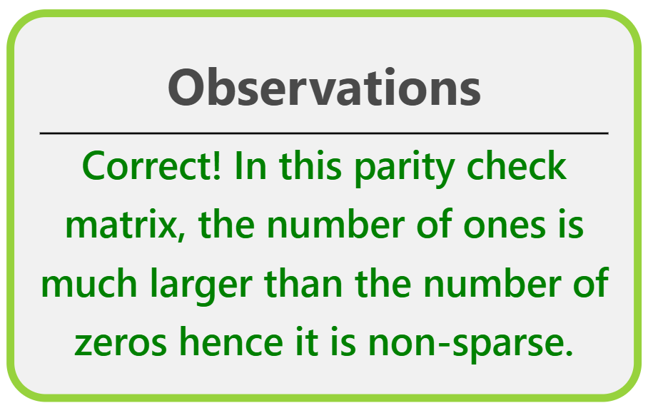
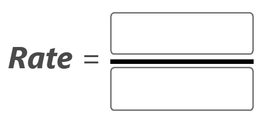
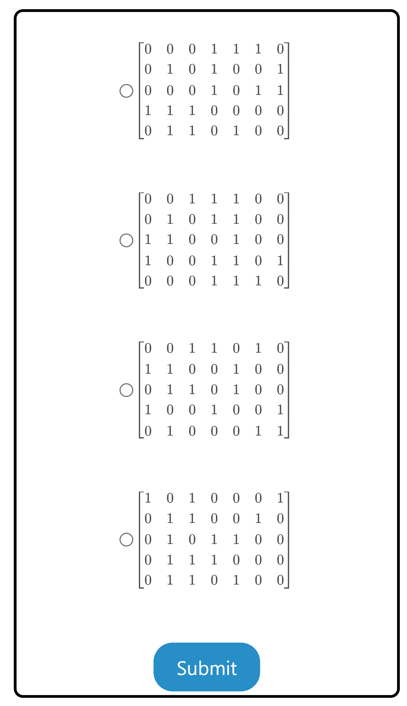
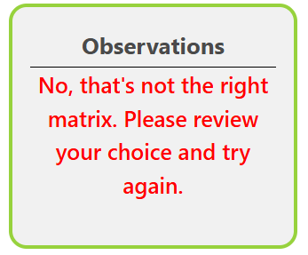
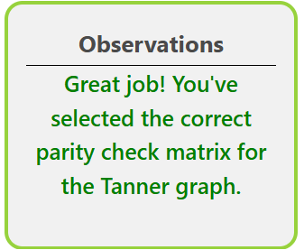

The experiment consists of two tasks. The user is recommended to go through these in the same sequence as they are presented. 

1. Low-Density Parity-Check (LDPC) Codes
    * Given a Parity Check Matrix, learn how to identify the type of LDPC code and its rate.
1. Tanner Graph for LDPC Codes
    * For given Tanner graph, learn how to identify corresponding Parity Check Matrix.

## Overview of the Experiment window

    
    

The experiment window consists of the following components:
1. **Task tab**: The task tab contains the list of tasks that need to be performed in the experiment. The user can navigate to any task by clicking on the corresponding task in the task tab.
2. **Instruction box**: The instruction box displays step-by-step instructions to perform the task.
3. **Question box**: The question box displays the question to be answered by the user.
4. **Observation box**: The observation box displays the feedback messages based on the user's input.
5. **Action box**: The action box contains the input elements and buttons to perform the task.

## Experiment: 

There are two tasks in this experiment.

### Task 1: Low-Density Parity-Check (LDPC) Codes

1. **Select type**: Choose the type of parity check matrix from the options provided. 
    
  

2. **Verify the type**: Click on "Check" to verify the selected option. 
    
  
  
    - Click on <strong>Yes</strong> if the given parity check matrix defines an LDPC code, else click on "No". The "Next" button will appear only if the answer is correct.
    - The observation box will display the feedback message accordingly.  
      
 
      
      
      

3. **Rate**: Enter the rate of the LDPC code by entering the numerator and denominator of the rate. Click on **Check** to verify the rate. Click on **Previous** to go back to the previous question. You can proceed to next task by clicking on the "Tanner Graph for LDPC Codes" tab.
    
   
    
 
      

### Task 2: Tanner Graph for LDPC Codes

1. **Select Parity Check matrix**: Select the option corresponding to the correct Parity Check matrix for the given Tanner graph.  
    

 
    - Select the option corresponding to the correct Parity Check matrix for the given Tanner graph.  
    - The observation box will display the feedback message accordingly.  
      
 
      
      
      

2. **Submit**: Click on **Submit** to verify the correctness of the Parity Check matrix for the given Tanner graph.  
    
 
 
    - Click on <strong>Submit</strong>> to verify the correctness of the Parity Check matrix for the given Tanner graph.  